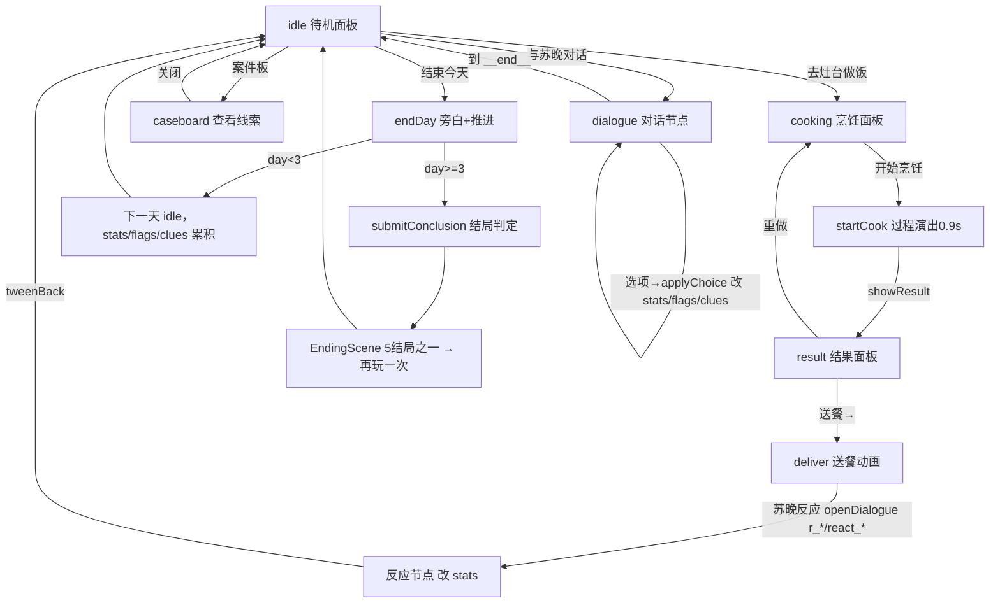

# 《恒温牢饭》游戏流程技术说明

> 文档目的：把游戏的**技术栈**、**运行环节**与**一环扣一环的闭环逻辑**一次性讲清，方便后续迭代、验收与接手。
> 适用范围：`src/game.js`（引擎/场景/状态机/表现层）、`src/data.js`（数据/对话路由/料理判定/结局判定）、`index.html`（加载与渲染）。

---

## 1. 技术栈

| 项 | 选型 | 说明 |
|---|---|---|
| 引擎 | **Phaser 3.80.1** | 本地 `libs/phaser.min.js`，经典 `<script>` 标签加载，**无构建步骤** |
| 语言 | 原生 JavaScript（ES6 class） | 无框架、无打包器 |
| 渲染 | `Phaser.AUTO`（Canvas/WebGL 自适应） | 抗锯齿已开启（`pixelArt:false`），像素纹理单独保留 NEAREST 采样 |
| 分辨率 | 逻辑画布 **960×540** | `Scale.FIT` + `CENTER_BOTH` 自适应容器，外部放大不破坏比例 |
| 资源 | **零外部素材** | 全部纹理由 `make.graphics()` + `generateTexture()` 程序生成（角色/瓦片/料理/UI 斜角面板） |
| 数据 | `window.DATA`（全局单例，由 `data.js` 注入） | 玩法逻辑与数据彻底分离：`game.js` 只消费，不改写文件 |
| 加载 | `file://` 直接打开 `index.html` | 无服务端、无网络依赖 |

---

## 2. 工程结构（文件职责边界）

```
index.html        → 入口：加载 phaser、data.js、game.js；canvas 容器；CSS 渲染设置
src/data.js       → 数据层（只读）：title/chapter/totalDays/ingredients/methods/platings/
                    clues/narration/dialogues(37节点)/endings(5)/truthClues/tagEffects
src/game.js       → 表现+状态层：BootScene / MainMenuScene / KitchenScene / EndingScene
libs/phaser.min.js→ 引擎
```

**关键边界（贯穿所有阶段，不可跨越）**：
- `data.js` 决定**说什么、触发什么、结局是什么**（对话路由 / 料理判定 / 结局阈值）。
- `game.js` 决定**怎么演、怎么画、怎么切状态**（场景流转 / 像素姿态 / 动画 / HUD）。
- 角色表现、UI 文本换行、分辨率等视觉改动**只允许落在 `game.js` + `index.html`**，不得回头改 `data.js` 的路由与判定。

---

## 3. 运行时架构

### 3.1 场景图（线性但可回环）

```
BootScene ──start──▶ MainMenuScene ──start──▶ KitchenScene ──start(endingId)──▶ EndingScene
   (生成纹理)              (标题/开始)            (核心玩法循环)                    (结局+再玩一次)
                                                                                      │
                                                                                      └─start──▶ KitchenScene（再玩）
```

### 3.2 模式状态机 `this.mode`（KitchenScene 内）

| 值 | 进入方式 | 含义 |
|---|---|---|
| `idle` | `renderBottomIdle()` | 待机：显示当日行动入口（对话/做饭/案件板/结束当天） |
| `dialogue` | `openDialogue()` | 对话/反应节点播放中 |
| `cooking` | `openCooking()` | 烹饪面板：选食材/做法/摆盘/火候 |
| `result` | `showResult()` | 料理结果面板：送餐 / 重做 |

> 交互锁 `this.locked` 与 `this.suLocked` 防止动画/表情在切换途中被抢占。

### 3.3 运行时状态对象 `this.state`（跨天保留，闭环载体）

```js
this.state = {
  day: 1,                       // 当前天数（totalDays=3）
  stats: {...prisoner.startingStats},  // 心理五维：trust/fear/anger/guilt/suspicion（0~100）
  flags: {},                    // 剧情开关（如 made_caramel / discovered_2315 / discovered_signal）
  clues: [],                    // 已收集线索 id 列表（驱动真相/结局）
  talkedToday: false,           // 当日是否已对话
  cookedToday: false,           // 当日是否已送餐
  dayPunish: false              // 当日是否触发惩罚线
}
```

---

## 4. 主循环闭环图（一天内的环）



> **为什么是闭环**：每一次「对话/料理」都在改写 `stats/flags/clues`；而这三个值又反过来决定「下一轮能选什么对话、苏晚什么表情、触发哪条反应、最终落到哪个结局」。行为→数值→解锁→新行为，自驱动直到第 3 天收口。

---

## 5. 环节逐环拆解（输入 → 处理 → 输出）

### 环 1 · idle 待机 `renderBottomIdle()`
- **输入**：一天开始 / 任意环节结束回调
- **处理**：清底栏 → `setLinPose('idle')` → `updateMood()` 按数值定苏晚表情 → 显示 4 入口
- **输出**：`结束今天` 按钮在 `talkedToday && cookedToday` 同时满足后高亮（闭环的「当日完成」闸门）

### 环 2 · dialogue 对话 `openTalk → openDialogue('d{day}_talk') → renderNode(id)`
- **输入**：节点 id（如 `d1_talk` / 反应节点 `r_qingku` / `react_memory`）
- **处理**：
  - `suPoseForNode(id)` 按节点映射苏晚表情（纯视觉，不改路由）
  - 渲染说话人+文本（**已开启 `useAdvancedWrap` 中文按字符换行**）
  - 选项带 `requires:[flag]`，不满足则灰显禁用
  - 选择 → `applyChoice()`：`effects` 改 `stats`、`set` 改 `flags`/`clues`
  - 递归 `renderNode(ch.next)` 直到 `__end__`
- **输出**：`stats/flags/clues` 变化 → 回调 `renderBottomIdle()`

### 环 3 · cooking 烹饪 `openCooking → startCook`
- **输入**：玩家选 ≤3 食材 + 1 做法 + 1 摆盘 + 火候(是否炒焦)
- **处理**：
  - `computeSpecial()`：食材组合+做法命中特殊料理（如 `qingku`/`caramel_truth`/`burnt_potato`）
  - `computeBaseEffects()`：`collectTags()` 汇总标签 → 查 `tagEffects` 得心理影响
  - 过程演出 ~0.9s（`spawnFx` 火焰/烟雾/蒸汽 tween）→ `showResult(r)`
- **输出**：`r = {name, special, base, tags}` 写入 `this.cook.result`

### 环 4 · deliver 送餐 `showResult → deliver(r)`
- **输入**：料理结果 `r`
- **处理**：
  - `setLinPose('serve')` + 林烬走向苏晚的 tween 动画（**送餐镜头**）
  - 若非特殊料理：`applyEffects(r.base)` 直接改 `stats`
  - 到达后 `openDialogue('r_'+special 或 'react_'+category)` 播放苏晚反应
  - 反应节点内部用 `effects` 控制关键数值（**特殊料理不走 base，由剧情节点接管**）
  - `tweenBack()` 林烬返回 → `renderBottomIdle()`
  - 惩罚判定：焦糊/羞辱类 → `dayPunish=true`、可能 `addClue('clue_signal')`
- **输出**：`cookedToday=true`、`stats/flags/clues` 追加

### 环 5 · caseboard 案件板 `openCaseBoard()`
- **输入**：已收集 `clues`
- **处理**：全屏遮罩两列卡片，点击展开详情（`showDetail`）
- **输出**：仅阅览，不改状态（情报沉淀环）

### 环 6 · endDay 结束当天 `endDay()`
- **输入**：玩家点「结束今天」
- **处理**：播放当日收尾旁白 → 若 `day>=totalDays` 走 `submitConclusion()`；否则 `day++` 并清空当日标记、播放次日开场旁白
- **输出**：跨天推进 / 或直接进结局

---

## 6. 数值闭环（闭环的真正引擎）

```
        玩家行为
       ┌──────────┐
       │ 对话选项  │
       │ 料理搭配  │──┬──▶ stats（信任/恐惧/愤怒/愧疚/警觉）
       └──────────┘  ├──▶ flags（剧情开关）
                     └──▶ clues（线索收集）
                            │
            ┌───────────────┼───────────────────────────┐
            ▼               ▼                            ▼
   ① flags 解锁后续    ② stats 决定            ③ clues 累计到
     对话 requires      苏晚表情(updateMood)     truthClues 阈值
                        与反应节点分支            → 真相连锁
            │               │                            │
            └───────────────┴───────────────────────────┘
                            ▼
                  下一天可说的/可做的
                  （行为空间被上一轮改变）
                            │
                            ▼
                  day3 endDay → submitConclusion → 结局
```

- **stats** 既是「因」也是「果」：料理标签改它，它又决定表情与反应。
- **flags** 是分支钥匙：例如 `made_caramel`（恒温奶羹）、`discovered_2315`（23:15 真相）是进入 `hidden` 结局的硬门槛。
- **clues** 累积到 `truthClues` 全集且 `trust>=50` → `truth` 真结局；否则降级为 `wrong_belief`。

---

## 7. 结局判定（闭环收口）`submitConclusion()`

按优先级判定，取第一个命中的结局：

| 优先级 | 条件 | 结局 |
|---|---|---|
| 1 | `fear>=80 && anger>=70` | `penalty_lose`（惩罚崩坏） |
| 2 | `clue_signal`∈clues && `discovered_2315` && `made_caramel` && `trust>=40` | `hidden`（隐藏真相） |
| 3 | `truthClues` 全部收集 && `trust>=50` | `truth`（真相/真结局） |
| 4 | `trust>=50` | `wrong_belief`（错信） |
| 5 | 其余 | `silence`（沉默） |

→ `EndingScene` 渲染结局徽章/正文/最终五维/线索清单 → 「再玩一次」`start('Kitchen')` 重置 `state` 回到环首。

---

## 8. 开发迭代流程（分阶段闭环，已落地）

游戏本体也按「**需求→实现→真实浏览器验收→确认闸口→下一阶段**」的闭环推进，每阶段只动约定层、不动其他层：

```
阶段1 基础玩法与对话路由  ──▶ game.js 骨架 + data.js 路由
   │ 验收(逻辑跑通)
   ▼
阶段2 视觉换肤(UI)        ──▶ 像素纹理/斜角面板/布局
   │ 验收(0报错)
   ▼
阶段3 角色互动表现         ──▶ 林烬4态/苏晚6表情纯表现切换
   │ 验收(状态切换/送餐/反应)
   ▼
阶段4 文本换行+分辨率修复   ──▶ useAdvancedWrap / 关pixelArt / 烹饪面板收回画布
   │ 验收(中文换行+按钮入画)
   ▼
阶段5(待定) 交互反馈/过场/数值动画 …  ←─ 用户确认后进入
```

**每阶段铁律**：改前备份 `game.js(.bak.*)` → 只改约定范围 → puppeteer-core 真实 Chrome 验收（`CONSOLE_ERRORS=0`）→ 发现逻辑问题**只暂停汇报、不顺手修**。

---

## 9. 如何验证「闭环没断」（验收清单）

1. `menu → kitchen` 进入待机，4 入口可见。
2. 对话走完 `d{day}_talk` 能回到 idle，且 `talkedToday=true`。
3. 烹饪后 `开始烹饪` 按钮在画布内（y≤540）、可点；`result` 面板出现。
4. 送餐动画播放、苏晚反应节点出现、`cookedToday=true`。
5. 反复一天：stats 在 HUD 上可见变化（数值闭环生效）。
6. 第 3 天「结束今天」→ 进入 5 结局之一；「再玩一次」回到 day1 且数值重置。
7. 控制台全程 0 报错。

---

*本文档随开发同步更新；任何跨层改动（动了 `data.js` 路由/判定，或破坏了上述任一环）都视为回归，需在验收阶段单独汇报。*
